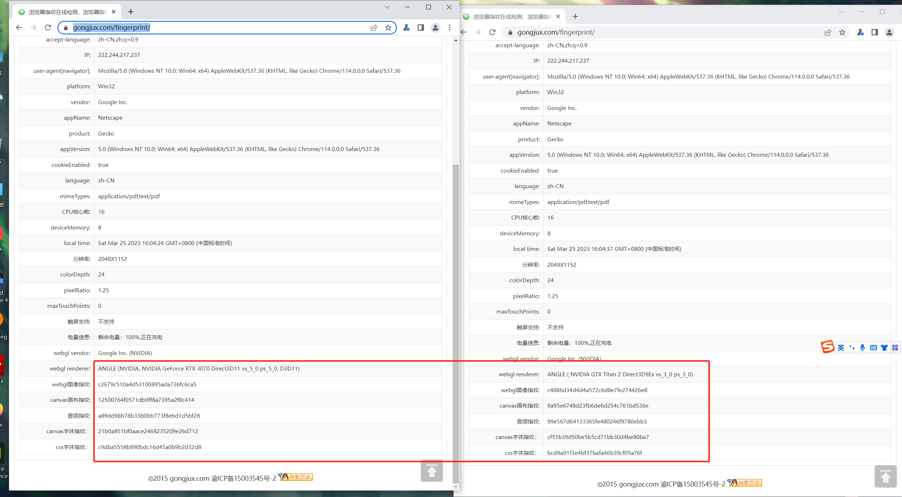

- # r0chrome
    - `r0chrome`是一款对chromium源码进行定制的浏览器,支持爬虫/JS逆向工程师进行辅助分析网页
    - ## 浏览器随机指纹模块
        - ### 实现功能：
        ```
        gpu信息随机
        webgl图像指纹随机
        canvas画布指纹随机
        音频指纹随机随机
        canvas字体指纹随机
        css字体指纹随机
        屏幕分辨率随机
        elements大小随机
        ```
        - ### 效果
            
            - 测试网站 
                - https://gongjux.com/fingerprint/
        - ### 源码
            - 修改的源代码在finger_change_code文件夹下
            - 修改的代码上面有`// add `的注释
        - ### 安装包
            - Win版本
                - http://www.dtasecurity.cn:20080/chrome.win.7z
                - 安装方法：
                    - 使用7z解压文件，在文件夹下打开chrome.exe即可使用
            - Linux版本
                - http://www.dtasecurity.cn:20080/chromium-browser-unstable_103.0.5045.0-1_amd64.deb
                - 安装方法
                    - 在ubuntu命令行中输入 
                        - sudo dpkg -i chromium-browser-unstable_103.0.5045.0-1_amd64.deb
                    - 然后在软件中或者命令行下即可打开浏览器
    - ## 浏览器环境自吐模块
        - ### 实现功能(后续会增加更多的对象监控)
        ```
        window 对象监控
        navigator 对象监控
        document 对象监控
        history 对象监控
        screen 对象监控
        ```
        - ### 原理简介
            - 对chromium源码中全局对象定义进行修改/添加，使得全局对象变得可以覆盖，从而使用JS的代理器对全局对象进行监控
        - ### 源码
            - 修改的源代码在monitor_change_code文件夹下
            - 修改的代码上面有`// add `和`// change `的注释
        - ### 使用方法
            - 在浏览器控制台中执行proxy.js的代码(推荐在JS最先执行的时机断点（事件侦听器断点->脚本->脚本的第一条语句）然后运行js代码，最先取得全局对象的控制权)
            - 然后在网页上正常操作即可在控制台得到打印的对象信息，进行环境监控，辅助JS补环境
        - ### 使用方法以及效果
            - 先设置断点 然后刷新网页 即可在JS最先执行的时机停下(需要注意安装油猴后，会对此方法产生影响导致proxy.js脚本不生效)
            
            - 执行proxy.js后取消断点 然后执行网页js
            
            - 成功监控对象
            
        - ### 安装包
            - Win版本
                - http://www.dtasecurity.cn:20080/chrome.win.7z
        - ### Tips
            - 碰到不需要打印的信息可以在proxy.js中修改代码进行过滤

- # 联系我们
    - #### 加v：r0ysue 进浏览器指纹随机定制群
- #### 后续会推出其他定制浏览器的功能
